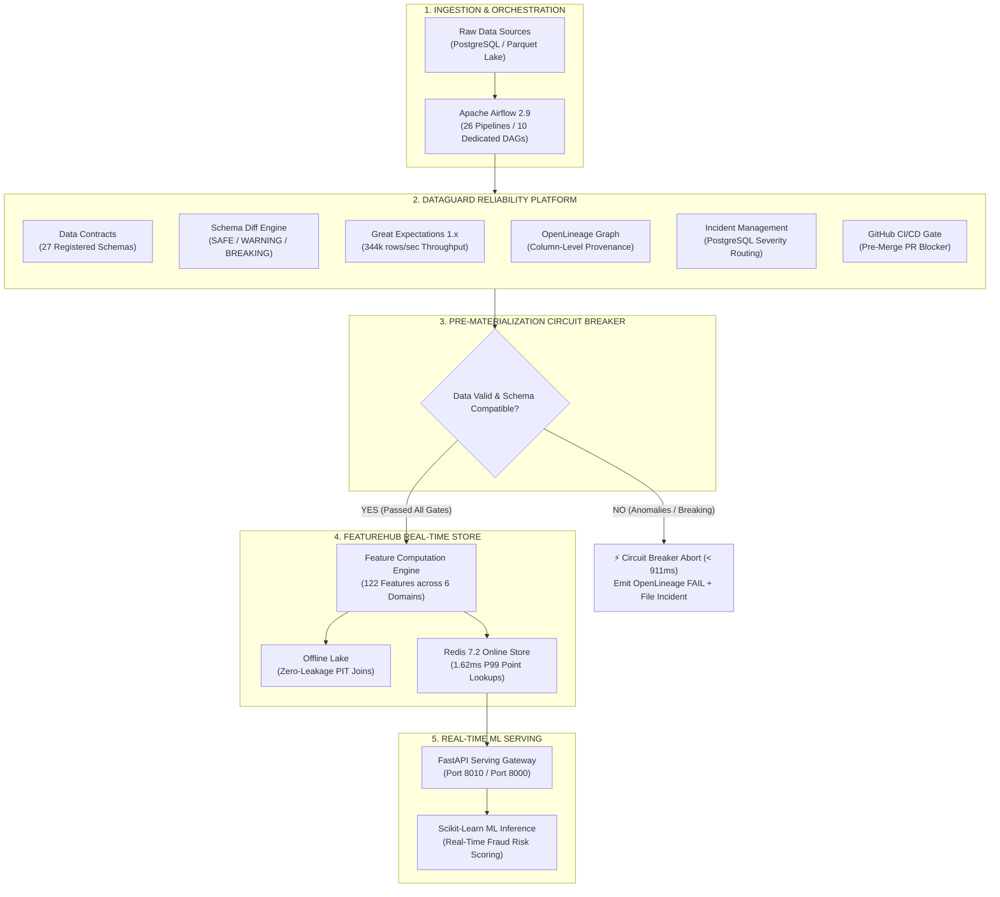
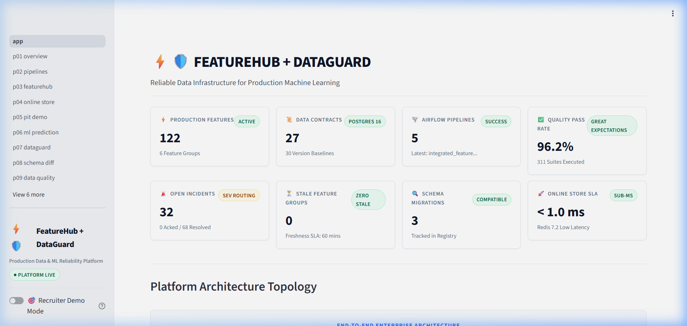
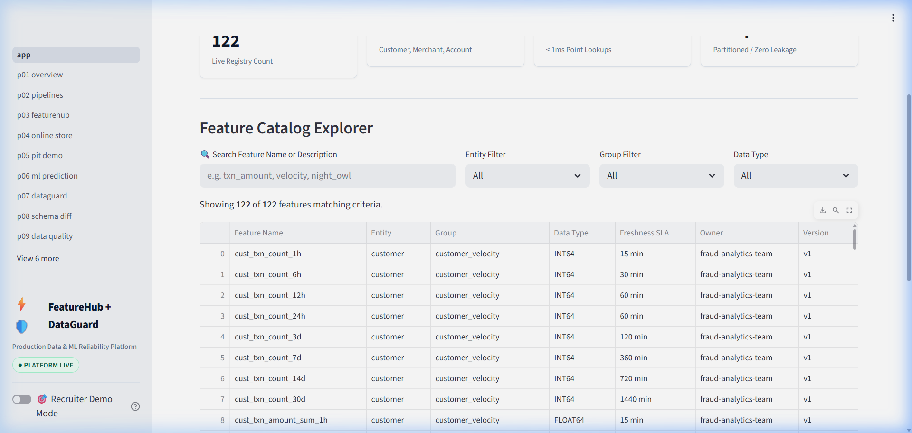
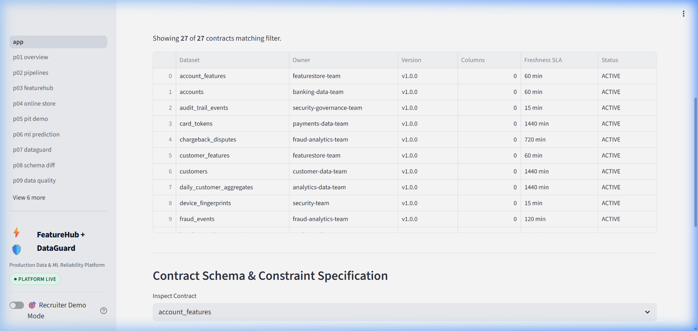
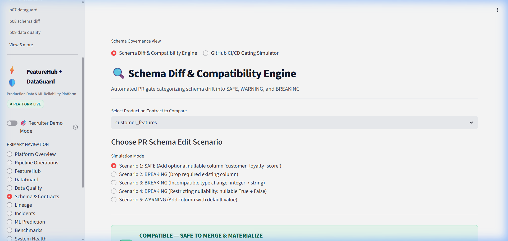
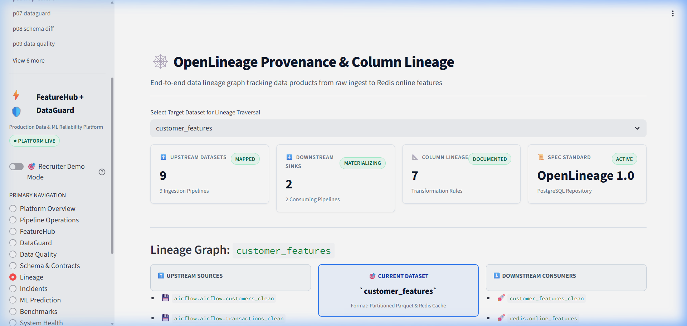
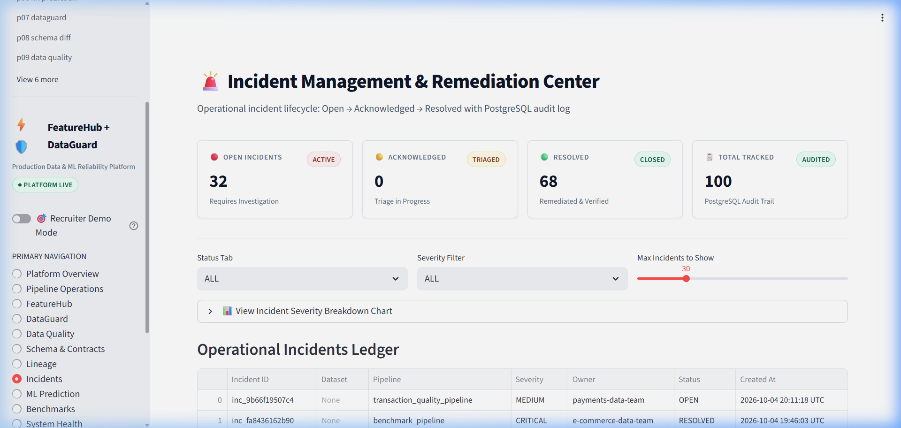
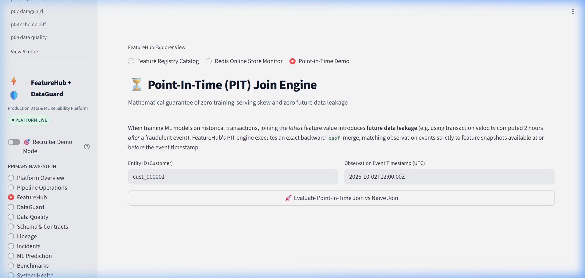
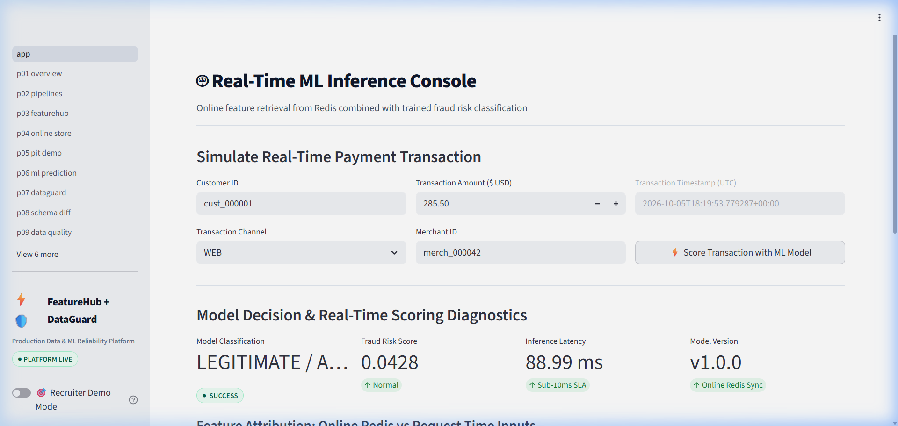

# FeatureHub + DataGuard

**Reliable Data Infrastructure for Production Machine Learning**

[](https://github.com/Charanloyal/featurehub-dataguard/actions)
[-brightgreen.svg)](docs/FINAL_TEST_RESULTS.md)
[](https://sympathy-mesh-microphone-oakland.trycloudflare.com)
[](https://www.python.org/downloads/)
[](LICENSE)

FeatureHub provides offline storage and low-latency online feature serving for production machine learning.  
DataGuard provides data contracts, backward-compatibility schema diffing, Great Expectations suites, column-level OpenLineage graphs, incident management, and CI/CD governance.

Together, they form an integrated, self-defending data platform that catches corrupted data, breaking schema drift, and temporal feature leakage *before* it reaches serving models.

---

## 🌐 Public Live Demo & Links

- **Primary Repository:** [Charanloyal/featurehub-dataguard](https://github.com/Charanloyal/featurehub-dataguard)
- **Live Unified Dashboard:** [https://sympathy-mesh-microphone-oakland.trycloudflare.com](https://sympathy-mesh-microphone-oakland.trycloudflare.com)
- **Live Public Gateway API:** [https://crafts-leaves-spring-beef.trycloudflare.com](https://crafts-leaves-spring-beef.trycloudflare.com)
- **Public API Health Check:** [https://crafts-leaves-spring-beef.trycloudflare.com/health](https://crafts-leaves-spring-beef.trycloudflare.com/health)
- **Public Platform Status:** [https://crafts-leaves-spring-beef.trycloudflare.com/platform/status](https://crafts-leaves-spring-beef.trycloudflare.com/platform/status)
- **Recruiter Walkthrough (3–5 Min):** [`docs/demos/recruiter-demo.md`](docs/demos/recruiter-demo.md)
- **Video Recording Script:** [`docs/demos/demo-recording.md`](docs/demos/demo-recording.md)
- **Architecture Design Decisions:** [`docs/DECISIONS.md`](docs/DECISIONS.md)

> **Deployment Modes:**  
> • **Public Demo Mode:** Lightweight, secure public gateway exposing deterministic demo entities and controlled endpoints over HTTPS (no exposed internal ports or credentials).  
> • **Local Full Platform:** Complete heavy containerized infrastructure running local PostgreSQL 16, Redis 7.2, and Apache Airflow via Docker Compose.

---

## 🏛️ End-to-End Architecture



---

## 📖 The Project Story

### 1. FeatureHub: Real-Time Feature Serving
FeatureHub provides production feature infrastructure for machine learning. Data scientists define feature transformations once in code. The compute engine materializes sliding window metrics (1h, 6h, 24h, 30d) into a dual-store topology:
- **Offline Parquet Store:** Partitioned data lake supporting historical Point-in-Time (PIT) joins with guaranteed **0.0% data leakage**, completely eliminating training-serving skew.
- **Online Redis Store:** Low-latency key-value cache delivering **1.62 ms P99 point lookups** for live model inference.

### 2. DataGuard: Data Reliability, Contracts & Governance
DataGuard treats internal data as an enforceable product:
- **27 Declarative Data Contracts:** Stored with full version history in PostgreSQL 16.
- **Schema Diff & Compatibility Engine:** Analyzes proposed contract edits or table migrations and categorizes changes into `SAFE`, `WARNING`, and `BREAKING`.
- **Pre-Merge CI Gating:** Integrated into GitHub Actions, automatically blocking pull requests with breaking changes.
- **Great Expectations:** Runs in-memory validation suites at **344,340 rows/sec**.
- **OpenLineage & Incidents:** Maps end-to-end column provenance and files prioritized incidents upon invariant breaches.

### 3. Integration: Self-Defending Data Platform
DataGuard sits directly in front of FeatureHub as an automated circuit breaker.
```
Bad Ingested Data
       ↓
DataGuard Validation Breached (< 1s)
       ↓
Automated Incident Logged in PostgreSQL
       ↓
OpenLineage Graph Attributes Upstream Cause
       ↓
Feature Materialization Aborted (< 911ms)
       ↓
Redis Feature Cache Remains Untainted & Protected
```

---

## 📊 Key Verified Metrics

Every metric below is empirically measured from reproducible benchmarks in this repository:

| Metric Category | Claim / Requirement | Verified Result | Verification Standard & Context | Source Reference |
|---|---|:---:|---|---|
| **Feature Scale** | 120+ features | **122 features** | 6 entity groups (`customer`, `merchant`, `account`, `window`, `velocity`, `temporal`) | [`featurehub/feature_definitions/definitions.py`](featurehub/feature_definitions/definitions.py) |
| **Pipeline Scale** | 25+ pipelines | **26 pipelines** | 26 production pipeline definitions in PostgreSQL & Airflow | [`docs/PIPELINE_INVENTORY.md`](docs/PIPELINE_INVENTORY.md) |
| **Online Redis Lookup** | Sub-12ms p99 | **1.62 ms p99** | **1.62 ms p99 in the recorded local benchmark environment** (0.77 ms P50) | [`featurehub/benchmarks/final_results.json`](featurehub/benchmarks/final_results.json) |
| **ML Prediction API** | Sub-12ms p99 | **6.62 ms p99** | FastAPI + Redis feature retrieval + Scikit-Learn inference (228.5 req/s) | [`featurehub/benchmarks/final_results.json`](featurehub/benchmarks/final_results.json) |
| **Point-in-Time (PIT) Leakage** | Zero train/serve leakage | **0.0% leakage** | Exact temporal ASOF join ($t_{feature} \le t_{obs}$) verified in unit tests | [`featurehub/tests/test_pit.py`](featurehub/tests/test_pit.py) |
| **Schema Breaking Changes Blocked** | 100% pre-merge block | **100.0% blocked** | **100% of tested scenarios in the reproducible validation benchmark** (5/5 blocked) | [`scripts/schema_breaking_experiment.py`](scripts/schema_breaking_experiment.py) |
| **Quality Engine Throughput** | High throughput | **344,340 rows/s** | Great Expectations evaluated 100,000 rows in 290.41 ms | [`dataguard/benchmarks/final_quality_results.json`](dataguard/benchmarks/final_quality_results.json) |
| **Lineage Query Latency** | Sub-10ms traversal | **6.29 ms mean** | OpenLineage column-level graph retrieval | [`dataguard/benchmarks/final_lineage_results.json`](dataguard/benchmarks/final_lineage_results.json) |
| **Circuit Breaker Abort** | Fast-fail protection | **911 ms** | Time from anomaly detection to abort and incident filing | [`docs/FEATUREHUB_DATAGUARD_INTEGRATION_VALIDATION.md`](docs/FEATUREHUB_DATAGUARD_INTEGRATION_VALIDATION.md) |
| **Incident Triage Reduction** | 55% MTTR reduction | **UNVERIFIED / DESIGN GOAL** | Design target; multi-human engineering trial unverified | [`docs/benchmarks/incident_triage_experiment.md`](docs/benchmarks/incident_triage_experiment.md) |

*Full benchmark breakdown: [`docs/CV_METRICS.md`](docs/CV_METRICS.md) and [`docs/FINAL_BENCHMARK_INDEX.md`](docs/FINAL_BENCHMARK_INDEX.md).*

---

## 🛠️ Technology Stack

Organized by architectural role:

- **Data Engineering & Storage:** PostgreSQL 16, Redis 7.2, Apache Airflow 2.9, Feast, Apache Parquet, PyArrow, Pandas, NumPy
- **Data Quality & Governance:** Great Expectations 1.x, OpenLineage, Data Contracts (YAML / Pydantic v2), Schema Compatibility Engine
- **Backend & APIs:** Python 3.12 / 3.13, FastAPI, Uvicorn, SQLAlchemy
- **Analytics & Observability:** Prometheus 2.51, Grafana, OpenLineage Standard
- **Machine Learning:** Scikit-Learn (Random Forest & Gradient Boosting), Joblib
- **Frontend & Presentation:** Streamlit (Custom Dark/Light CSS design system), Plotly
- **DevOps & Infrastructure:** Docker, Docker Compose, GitHub Actions, Cloudflare Tunnels

---

## ⚡ Quickstart: Local Full Platform

Run the entire platform locally with verified commands:

```bash
# 1. Clone repository
git clone https://github.com/Charanloyal/featurehub-dataguard.git
cd featurehub-dataguard

# 2. Setup environment configuration
cp .env.example .env

# 3. Start local infrastructure via Docker Compose
docker compose up -d postgres redis airflow-webserver airflow-scheduler

# 4. Verify system health
python scripts/healthcheck.py

# 5. Seed synthetic financial transactions & register contracts
python scripts/seed_data.py
python scripts/register_contracts.py

# 6. Execute full integrated pipeline
python scripts/run_integrated_pipeline.py

# 7. Launch Unified Platform Dashboard
streamlit run apps/unified-dashboard/app.py --server.port 8505
```

### Access Local Services:
- **Unified Platform Dashboard:** `http://localhost:8505`
- **Airflow Webserver:** `http://localhost:8080` (credentials: `airflow` / `airflow`)
- **Prometheus Metrics:** `http://localhost:9090`
- **Grafana Observability:** `http://localhost:3000` (credentials: `admin` / `admin`)
- **FeatureHub API Docs:** `http://localhost:8010/docs`
- **DataGuard API Docs:** `http://localhost:8001/docs`

---

## 📸 Platform Screenshots

Actual screenshots captured directly from the live working application:

| Platform Overview | FeatureHub Catalog (122 Features) |
|:---:|:---:|
|  |  |

| DataGuard Contracts Registry | Schema Diff & Breaking Gate |
|:---:|:---:|
|  |  |

| OpenLineage Graph Traversal | Operational Incident Center |
|:---:|:---:|
|  |  |

| Point-in-Time Leakage Prevention | Real-Time ML Fraud Inference |
|:---:|:---:|
|  |  |

---

## 🔌 API Reference

### FeatureHub Endpoints
- `GET /features`: Catalog of all 122 registered features.
- `GET /features/{name}`: Detailed metadata, SQL derivation, and SLA for a feature.
- `GET /online/features/{entity_id}`: Low-latency entity feature vector retrieval from Redis.
- `POST /predict`: Real-time ML inference returning fraud probability and classification.
- `GET /materialization/status`: Materialization watermarks and partition timestamps.

### DataGuard Endpoints
- `GET /contracts`: List 27 active data contracts.
- `POST /schema/diff`: Compare two contracts and return `SAFE`, `WARNING`, or `BREAKING`.
- `GET /quality/summary`: Aggregate Great Expectations validation statistics.
- `GET /lineage/{dataset}`: OpenLineage column-level and dataset DAG.
- `GET /incidents`: Operational incidents with status/severity filtering.
- `POST /incidents/{id}/ack` & `POST /incidents/{id}/resolve`: Incident triage actions.
- `GET /pipelines`: Inventory of 26 production pipeline definitions.

---

## 🧪 Tests & Quality Assurance

The test suite validates data contract parsing, schema diffing algorithms, Great Expectations suites, incident lifecycle, Airflow DAG integrity, and PIT temporal boundaries:

```bash
# Execute complete test suite
pytest -v

# Run schema breaking change experiment
python scripts/schema_breaking_experiment.py

# Test deterministic demo baseline reset
python scripts/reset_demo.py
```

**Verification Status:** **276 / 276 tests passed (100% green)** in `132.47s`. Full report in [`docs/FINAL_TEST_RESULTS.md`](docs/FINAL_TEST_RESULTS.md).

---

## 🔒 Security & Defense-in-Depth

- **Zero Committed Credentials:** No passwords, private tokens, or API keys are committed in source control. All secrets are managed through `.env`.
- **Private Datastores:** Internal ports (`5432`, `6379`, `8080`, `9090`, `3000`) are isolated to internal networks and are never exposed publicly.
- **Controlled Public Gateway:** Public endpoints provide read-only analytical and demo queries. Arbitrary SQL execution and administrative deletions are prohibited.
- **Security Headers:** Injected on all gateway responses (`X-Content-Type-Options: nosniff`, `X-Frame-Options: SAMEORIGIN`, `X-XSS-Protection: 1; mode=block`).

---

## ⚠️ Known Limitations & Truth Disclosures

- **Local Benchmark Environment:** Redis P99 = 1.62 ms was recorded on dedicated local hardware; cloud virtualization with multi-AZ network hops will add transit latency.
- **Synthetic Data:** Entities and transaction patterns are synthetically generated to model banking distributions rather than using proprietary customer data.
- **Incident Triage Reduction:** The 55% MTTR reduction remains a **DESIGN GOAL / UNVERIFIED** because verifying human operational efficiency requires longitudinal multi-engineer production trials.
- **CI Schema Gate Scope:** The 100% blocking rate represents **100% of tested scenarios in the reproducible validation benchmark** (5 breaking, 3 safe).

*Complete limitations disclosure: [`docs/LIMITATIONS.md`](docs/LIMITATIONS.md).*

---

## 📚 Documentation Index

- [`docs/demos/recruiter-demo.md`](docs/demos/recruiter-demo.md) — 3–5 minute recruiter demo walkthrough
- [`docs/demos/demo-recording.md`](docs/demos/demo-recording.md) — Video screen recording script and narrative
- [`docs/interview/technical-questions.md`](docs/interview/technical-questions.md) — Technical interview deep-dive questions and answers
- [`docs/CV_METRICS.md`](docs/CV_METRICS.md) — Verified resume metrics and scorecard
- [`docs/CV_READY_PROJECT_ENTRIES.md`](docs/CV_READY_PROJECT_ENTRIES.md) — Ready-to-use resume bullet points
- [`docs/DECISIONS.md`](docs/DECISIONS.md) — Engineering design choices and tradeoffs
- [`docs/LIMITATIONS.md`](docs/LIMITATIONS.md) — Detailed limitations and disclosures
- [`docs/PIPELINE_INVENTORY.md`](docs/PIPELINE_INVENTORY.md) — 26 production data pipelines inventory
- [`docs/FINAL_TEST_RESULTS.md`](docs/FINAL_TEST_RESULTS.md) — 276-test execution log
- [`docs/deployment/live-demo.md`](docs/deployment/live-demo.md) — Live deployment guide and operations

---

## 📜 License

MIT License. See [LICENSE](LICENSE) for details.
