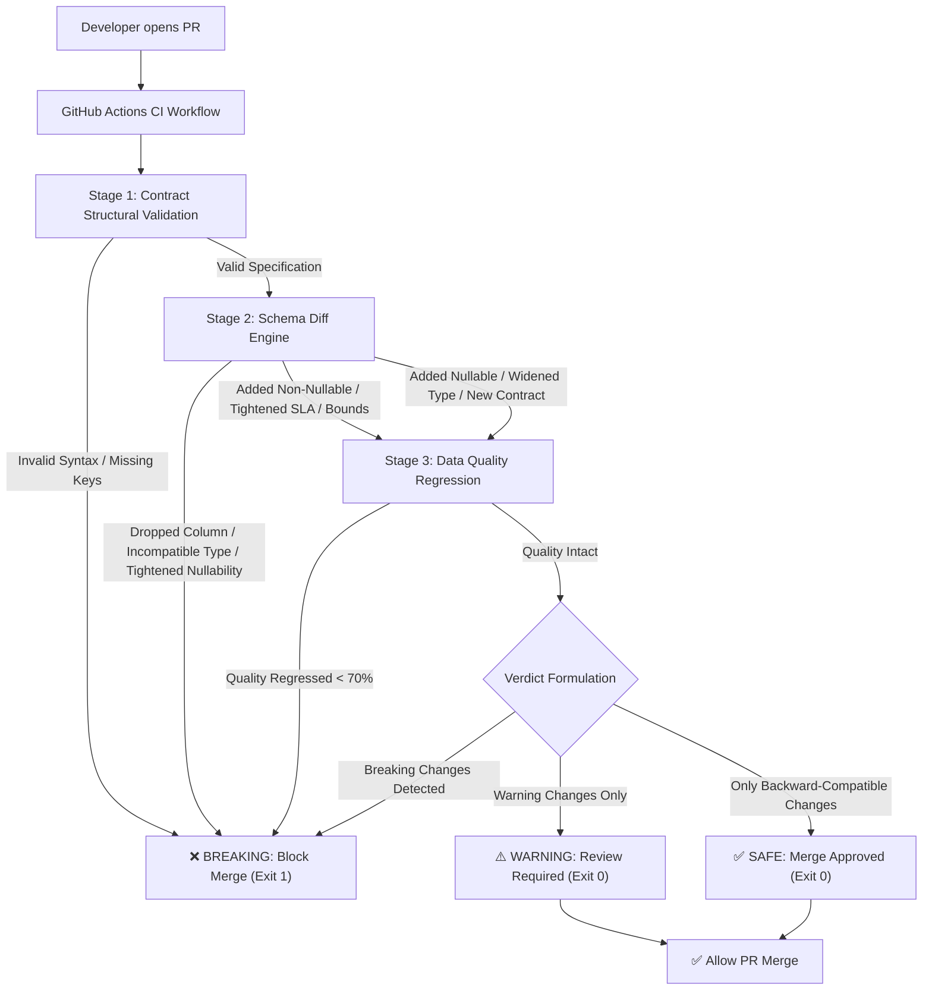

# DataGuard CI/CD Pull Request Gating Architecture

**Phase**: STAGE 3 — PHASE H: GITHUB CI/CD GATING  
**Status**: COMPLETE & VERIFIED  

---

## 1. Executive Summary

DataGuard Phase H introduces automated, deterministic pre-merge gating for Pull Requests modifying data contracts.
Whenever a developer modifies or proposes contract changes, GitHub Actions executes DataGuard's 3-stage verification pipeline:



---

## 2. Core Architectural Components

### A. CI/CD Gating Engine (`dataguard/ci/gate.py`)
The central orchestrator `CICDContractGatingEngine` manages the 3 verification stages:
1. **Contract Structural Validation**: Invokes `ContractValidator.validate_contract(target)` to verify root keys (`dataset`, `version`, `owner`, `freshness_sla_minutes`, `columns`, `constraints`), mandatory column attributes (`name`, `type`, `nullable`, `unique`, `description`), valid data types (`string`, `numeric`, `integer`, `timestamp`, `float`), and enum formats.
2. **Schema Diff Compatibility Analysis**: Uses `SchemaDiffEngine.compare_contracts(baseline, target)` to calculate pairwise structural deltas across columns, data types, nullability, enums, numeric ranges, and SLAs.
3. **Data Quality Regression Testing**: Runs Great Expectations validation against sample datasets to guarantee that updated contract constraints do not cause quality scores to fall below the acceptable threshold (70.0%).
4. **Remediation Generator**: Automatically provides actionable, consumer-aware remediation steps for any breaking or warning changes detected.

### B. CLI Runner for GitHub Actions (`scripts/ci_contract_gate.py`)
A standalone Python executable designed to run within CI runners:
- **Git Diff Detection**: Uses `git diff --name-only origin/main...HEAD` to automatically isolate modified contract YAML files.
- **Baseline Extraction**: Reads pre-PR contract definitions directly from `git show origin/main:<path>`.
- **GitHub Step Summary**: Formats a rich GitHub-flavored Markdown report written to `$GITHUB_STEP_SUMMARY`.
- **Deterministic Exit Code**: Exits with `0` (Allow Merge) for `SAFE` or `WARNING` verdicts; exits with `1` (Block Merge) for `BREAKING` modifications.
- **Administrative Override**: Supports `--allow-breaking` for emergency operational hotfixes.

### C. FastAPI CI Gating Endpoints (`dataguard/api/main.py`)
Exposes programmatic gating services for external CI/CD tools, GitLab CI, or custom webhooks:
- `POST /ci/gate`: Evaluates a single contract change against an optional baseline.
- `POST /ci/gate/pr`: Evaluates a batch of PR contracts, returning aggregated metrics and markdown tables.

---

## 3. Severity & Merge Policy Matrix

| Severity | Triggers | CI Verdict | GitHub Actions Status | Merge Allowed? |
| :--- | :--- | :---: | :---: | :---: |
| **BREAKING** | • Dropped column<br>• Incompatible type change (`string -> integer`, `numeric -> string`)<br>• Tightened nullability (`nullable: true -> false`)<br>• Removed allowed enum values<br>• Invalid YAML structure / missing mandatory keys<br>• Quality score regression below 70% | `BREAKING` | **FAILED** (Exit code `1`) | ❌ **BLOCKED** |
| **WARNING** | • Added non-nullable column without default<br>• Tightened freshness SLA (e.g. 60m $\to$ 15m)<br>• Tightened numeric bounds (`min` / `max`) | `WARNING` | **PASSED** (Exit code `0`) | ⚠️ **ALLOWED** (Review Advised) |
| **SAFE** | • Added nullable column (`nullable: true`)<br>• Widened numeric type (`integer -> numeric`)<br>• Relaxed nullability (`nullable: false -> true`)<br>• Added allowed enum value<br>• Relaxed freshness SLA or range bounds<br>• Added brand new contract | `SAFE` | **PASSED** (Exit code `0`) | ✅ **ALLOWED** |

---

## 4. Markdown Report Schema for PRs

When executed in GitHub Actions, DataGuard posts a detailed summary to the pull request:

```markdown
## ❌ DataGuard CI Gate: MERGE BLOCKED (BREAKING CHANGES)

> **PR contains breaking contract changes.** Merging is blocked to prevent downstream pipeline failures and schema mismatch errors.

### Summary Overview
- **Overall Verdict**: `BREAKING`
- **Merge Status**: `BLOCKED`
- **Contracts Evaluated**: `1`
- **Breaking Changes**: `1`
- **Warning Changes**: `0`
- **Safe Changes**: `0`

### Contract Evaluation Breakdown

| Dataset | File | Verdict | Breaking | Warnings | Safe | Quality Status |
| :--- | :--- | :---: | :---: | :---: | :---: | :---: |
| `orders` | `dataguard/contracts/orders.yaml` | ❌ BREAKING | 1 | 0 | 0 | 98.4% |

### Detailed Schema Modifications & Remediation

| Dataset | Column | Severity | Change Type | Description | Recommended Action |
| :--- | :--- | :---: | :--- | :--- | :--- |
| `orders` | `amount` | 🔴 BREAKING | `COLUMN_REMOVED` | Column 'amount' was dropped from contract. | Column removal is BREAKING for downstream consumers. Instead of dropping 'amount', deprecate it first, maintain nullability, or publish a major version (v2.0.0). |
```
