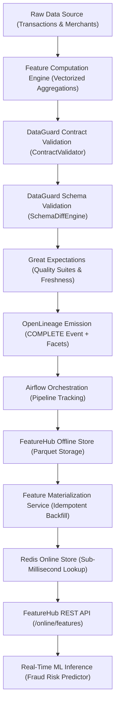
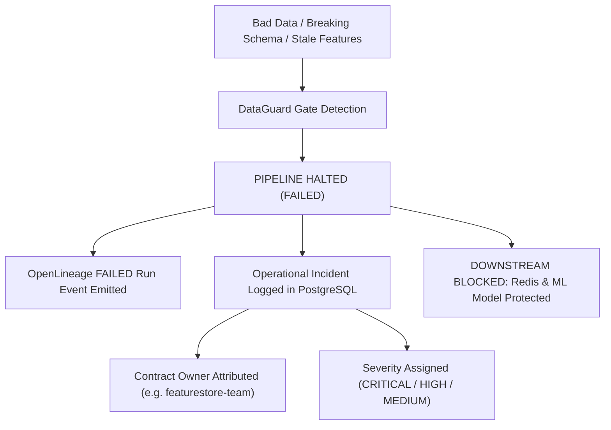

# FeatureHub + DataGuard Integrated Platform Architecture

**Phase**: STAGE 3 — PHASE I: FEATUREHUB + DATAGUARD FINAL INTEGRATION  
**Status**: COMPLETE & VERIFIED  

---

## 1. Executive Summary

Phase I connects FeatureHub (the Real-Time Feature Store & Serving Engine) and DataGuard (the Data Quality, Schema Contracts & Column-Level Lineage Platform) into one coherent, production-grade data platform.

Data flows through two deterministic execution paths:

### 1. Happy Path (Verified End-to-End Flow)

### 2. Failure Path (Data Integrity Protection)

---

## 2. The 11-Stage Integration Lifecycle

| Stage # | Stage Name | Component Responsible | Core Operation |
|:---:|:---|:---|:---|
| **01** | `DATA_SOURCE` | Storage Layer (`data/raw/`) | Verifies raw transactional events and merchant master records exist and are accessible. |
| **02** | `FEATURE_COMPUTATION` | `featurehub.computation.engine` | Calculates 120+ windowed rolling features (1h, 6h, 24h, 7d, 30d) and velocity risk composites. |
| **03** | `CONTRACT_VALIDATION` | `dataguard.contracts.validator` | Validates structural YAML compliance, mandatory root attributes, and column specs against `customer_features.yaml`. |
| **04** | `SCHEMA_VALIDATION` | `dataguard.schema.diff` | Pairwise comparison detecting schema drift, column drops, incompatible type shifts, or tightened nullability. |
| **05** | `DATA_QUALITY` | `dataguard.quality.runner` | Runs Great Expectations 1.x suites auditing null rates, numeric ranges, row counts, and freshness SLAs. |
| **06** | `OPENLINEAGE` | `dataguard.lineage.collector` | Emits standard OpenLineage `COMPLETE` RunEvent with inputs (`transactions`, `merchants`) and columnLineage facets. |
| **07** | `AIRFLOW_ORCHESTRATION`| `dataguard.pipelines.repository` | Persists pipeline run record, execution duration, and metadata in PostgreSQL `pipeline_runs`. |
| **08** | `OFFLINE_STORE` | `data/offline_store/` | Writes clean, validated features to `customer_features.parquet`. |
| **09** | `MATERIALIZATION` | `featurehub.materialization` | Materializes offline feature vectors into Redis Online Store with entity keys and TTLs. |
| **10** | `REDIS_ONLINE_STORE` | `featurehub.online_store` | Verifies low-latency key retrieval for entity (e.g. `featurehub:customer:cust_000001`). |
| **11** | `ML_PREDICTION` | `featurehub.inference.predictor`| Retrieves live online features from Redis and computes real-time fraud probability scores. |

---

## 3. Failure Gating & Incident Management

Whenever a data quality or schema regression occurs:
1. **Immediate Pipeline Abort**: Downstream writes to the offline store and Redis online store are **SKIPPED**.
2. **OpenLineage Telemetry**: Emits a `FAIL` RunEvent with the exact failing stage, error details, and timestamp.
3. **Automated Incident Routing**: `IncidentManager` files an incident in PostgreSQL:
   - **Owner Attribution**: Extracted directly from contract metadata (e.g., `featurestore-team`, `customer-risk-team`).
   - **Severity Policy**:
     - `CRITICAL`: Breaking schema modifications, primary key violations.
     - `HIGH`: Illegal NULL values in mandatory feature attributes.
     - `MEDIUM`: Freshness SLA breaches, value set / range anomalies.
   - **FSM State**: Initialized to `OPEN` with an immutable audit event recorded in `incident_events`.
4. **Online Store Protection**: Existing clean features in Redis are **never overwritten**, shielding downstream ML serving APIs from model degradation or crashes.
